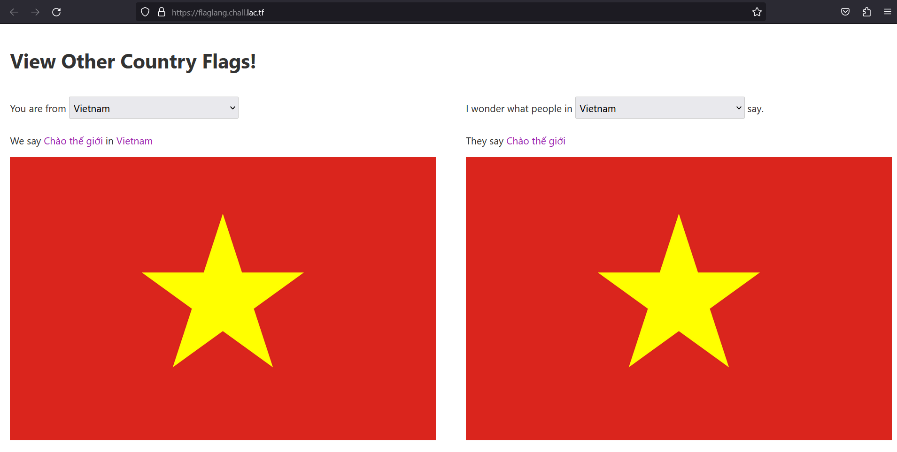
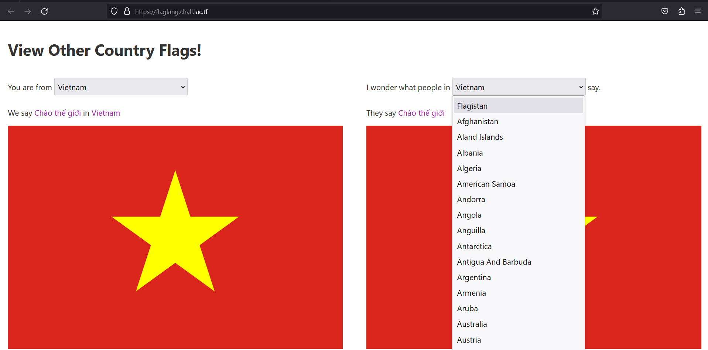
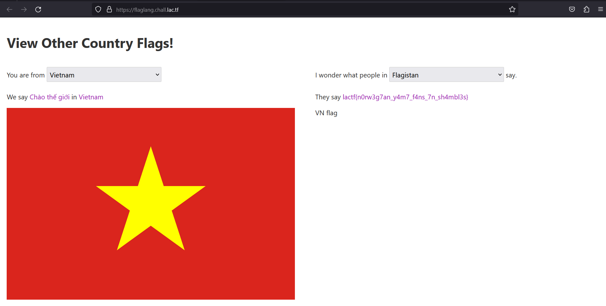

## Overview

* 607 solves / 133 points
* author: r2uwu2

## Description

> Do you speak the language of the flags?

### Attached

[flaglang.zip](attached/flaglang.zip)

## Solution

Check the ```countries.yaml``` file

```yaml
Flagistan:
  iso: FL
  msg: "<REDACTED>"
  password: "<REDACTED>"
```

Just select ```Flagistan``` and get flag.

Visit the site



There it is



Choose it



The flag is
```
lactf{n0rw3g7an_y4m7_f4ns_7n_sh4mbl3s}
```